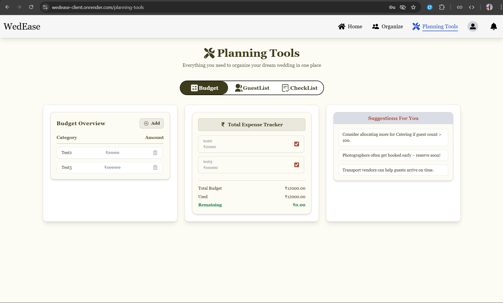
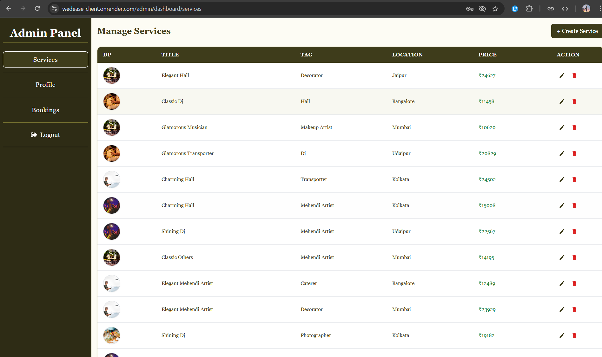

# 💒 Wedease – Your Ultimate Wedding Service Booking Platform

> A full-stack wedding service platform to plan, book, and organize your big day with ease.

---

## 📝 Description

**Wedease** is a full-featured web application that enables users to find, filter, and book trusted wedding service providers such as venues, photographers, decorators, and more across top Indian cities.

The platform supports features like real-time availability checks, booking protection, service management, admin dashboard, and wedding planning tools — all under one roof.

---

## 📚 Table of Contents

* [Features](#-features)
* [Tech Stack](#-tech-stack)
* [Installation](#-installation)
* [Usage](#-usage)
* [Screenshots](#-screenshots)
* [Credits](#-credits)
* [Upcoming Features](#-upcoming-features)
* [Contributing](#-contributing)
* [License](#-license)

---

## 🌟 Features

* 🔍 **Advanced Filtering** – Search and filter services by category, city, tags, and keywords.
* 📃 **Paginated Listings** – Load services efficiently with pagination.
* 📷 **Image Uploads** – Integrated with Cloudinary for image handling.
* 🧾 **Wedding Planning Tools** – Budget tracker, guest list, and checklist management.
* 🔐 **JWT Authentication** – Secure login for users and admins.
* 👨‍💼 **Admin Dashboard** – Manage and approve services.
* ❌ **Booking Conflict Protection** – Prevents users from booking already-reserved time slots.
* 💬 **Review System** – Coming soon.
* 💸 **Payment Integration** – Coming soon.
* 🔔 **Real-time Notifications** – Planned for next release.

---

## 🧠 Tech Stack

**Frontend:**

* React.js
* Tailwind CSS
* React Router
* Zustand (state management)

**Backend:**

* Node.js
* Express.js
* MongoDB + Mongoose

**Cloud & Tools:**

* Cloudinary (image uploads)
* Multer (file uploads)
* JWT (authentication)
* Axios (HTTP client)
* dotenv (environment variables)

---

## 🛠️ Installation

Clone the repo and install dependencies for both client and server:

```bash
git clone https://github.com/harshrathore2303/WeddingEase.git
cd WeddingEase

# Server setup
cd server
npm install

# Client setup
cd ../client
npm install
```

### 🔐 Environment Setup

Create `.env` files in both `server` and `client` directories.

#### Server `.env`

```env
PORT=5000
MONGODB_URI=your_mongodb_connection_string
CLOUDINARY_CLOUD_NAME=your_cloudinary_name
CLOUDINARY_API_KEY=your_api_key
CLOUDINARY_API_SECRET=your_api_secret
JWT_SECRET=your_jwt_secret
```

---

## ▶️ Usage

Start both the backend and frontend locally:

```bash
# Backend
cd server
npm run dev

# Frontend
cd ../client
npm run dev
```

Then navigate to: [http://localhost:5173](http://localhost:5173)

---

## 📸 Screenshots

### User Interface




### Admin Panel



---

## 👌 Credits

* 👨‍💻 **Developer:** [Harshit Singh Rathore](https://github.com/harshrathore2303)
* 🤝 **Collaborator:** [Ayush Rathi](https://github.com/ayush1234rathi)
* ☁️ **Image Storage:** [Cloudinary](https://cloudinary.com/)

---

## 🚀 Upcoming Features

* ↻ Real-time updates via WebSockets
* 💳 Razorpay/Stripe integration for payments
* 🧾 Invoice and booking history
* 💬 Live review & rating system

---

## 🤝 Contributing

We welcome contributions from the community! If you'd like to help improve this project:

1. Fork the repository
2. Create a new branch (`git checkout -b feature/YourFeatureName`)
3. Commit your changes (`git commit -m 'Add new feature'`)
4. Push to the branch (`git push origin feature/YourFeatureName`)
5. Create a Pull Request

Feel free to open issues for any bugs or suggestions.

---

## 🪪 License

This project is licensed under the **MIT License**.
[Learn more about licenses →](https://choosealicense.com)

---

## 🌐 Live Preview

🔗 [Visit Live Site](https://wedease-client.onrender.com)
